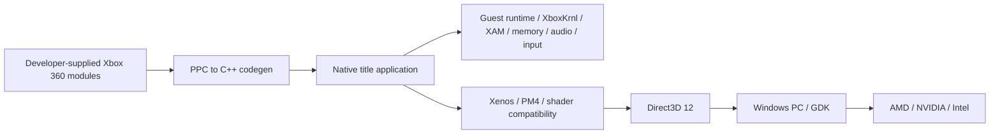

# ReXGlue SDK — Windows/GDK modernization fork

ReXGlue converts Xbox 360 PowerPC code into C++ ahead of time and provides the
runtime services needed by the resulting native title applications. This fork
targets **Windows PC, Microsoft GDK April 2026, and Direct3D 12**, with validation
across compatible AMD, NVIDIA and Intel GPUs.

**Status:** early-development modernization of upstream ReXGlue v0.10.0
(`c94f5ebdcb3c9d1a460ca48e04f9758448f8d518`). Windows is the only supported
host (Linux and macOS retired by RG-GDK-024) and Direct3D 12 is the only
graphics backend (Vulkan removed by RG-GDK-023). GDK integration, native API
migrations and vendor/title compatibility are not yet validated. Public APIs
may change.

## Purpose and architecture

Guest CPU code is statically recompiled. A title project builds the generated
C++ and registers its functions with the runtime; this is not a general-purpose
XEX launcher with a PPC interpreter/JIT fallback. GPU shader translation remains
part of Xenos compatibility and is separate from CPU recompilation.



Preserve guest semantics above host APIs: native Windows/GDK services do not
automatically implement Xbox 360 kernel, XAM, XMA, profiles or storage behavior.
See [architecture plan](docs/architecture-plan.md) and [decisions](docs/adr/README.md).

| Channel | CI | Download |
| --- | --- | --- |
| Release | [](https://github.com/rexglue/rexglue-sdk/actions/workflows/build-win-amd64.yaml) | [Latest stable](https://github.com/rexglue/rexglue-sdk/releases/latest) |
| Nightly | [](https://github.com/rexglue/rexglue-sdk/actions/workflows/nightly.yaml) | [Latest pre-release](https://github.com/rexglue/rexglue-sdk/releases?q=prerelease%3Atrue) |

## Repository relationships

* [furqanagwan/rexglue-sdk](https://github.com/furqanagwan/rexglue-sdk) is the
  implementation and issue target.
* [Upstream ReXGlue](https://github.com/rexglue/rexglue-sdk) supplies the static
  SDK foundation, inspired by XenonRecomp and rexdex's recompiler.
* [Xenia](https://github.com/xenia-project/xenia),
  [Canary](https://github.com/xenia-canary/xenia-canary) and
  [Edge](https://github.com/has207/xenia-edge) are compatibility research sources.
* [furqanagwan/xenia-edge](https://github.com/furqanagwan/xenia-edge) is a
  controlled reference/experiment fork, not a dependency required to run ReXGlue.

For the Windows D3D12 compatibility baseline and the first Quantum of Solace
run, see [baseline capture](docs/baseline-capture.md). That document records an
early failing run; current title progress is tracked in the 007 repository.
For the April 2026 GDK PC capability map and issue ownership, see the
[GDK capability audit](docs/gdk-2604-capability-audit.md).
Only NVIDIA GPU testing is available locally; AMD and Intel coverage is
non-blocking and remains untested under [ADR-007](docs/adr/ADR-007-local-gpu-validation-scope.md).

For quick start guide, full CLI reference, and config file options, see the [wiki](https://github.com/rexglue/rexglue-sdk/wiki).

ReXGlue has independent Git history containing adapted Xenia-derived source.
There is no proven single Xenia base revision for the entire initial import.
The [ancestry analysis](docs/investigation.md) records exact reachable tips,
historical boundaries and later source imports. Upstream repositories are not
modified by this fork's roadmap work.

## Requirements

Current Windows x64 developer workflow requires Git with submodules, CMake 3.25
or newer, Ninja, LLVM Clang 18 or newer with C++23 support, Visual Studio C++
build libraries and a Windows SDK. Use an x64 Visual Studio developer shell so
Clang can find CRT libraries. The preset `win-amd64` denotes CPU architecture;
it does **not** restrict the GPU to AMD.

D3D12 device creation currently requests feature level 11_0 and queries optional
features. That is not a promise that every FL11_0 GPU supports every rendering
path or title. See the [capability/vendor matrix](docs/regression-strategy.md).
No AMD/NVIDIA/Intel compatibility certification has been completed here.

PPC instruction tests use bundled `tools/binutils/powerpc-none-elf-as.exe`,
`powerpc-none-elf-ld.exe`, `powerpc-none-elf-nm.exe` and their runtime DLLs.
The FFmpeg submodule is part of XMA decoding; do not replace it with an arbitrary
system FFmpeg build. Vulkan SDK is not required for the documented D3D12-only
Windows configuration.

## Build and install the current SDK

From an x64 Visual Studio developer shell:

```powershell
git clone --recurse-submodules https://github.com/furqanagwan/rexglue-sdk.git
cd rexglue-sdk
git submodule update --init --recursive
cmake --preset win-amd64 -DREXGLUE_USE_D3D12=ON -DREXGLUE_USE_VULKAN=OFF -DREXGLUE_BUILD_TESTS=ON
cmake --build --preset win-amd64-debug
ctest --preset win-amd64-debug --output-on-failure
cmake --build --preset win-amd64-release
ctest --preset win-amd64-release --output-on-failure
cmake --install out/build/win-amd64 --config Release
```

Install prefix defaults to `out/install/win-amd64`. These are commands derived
from the current presets/CMake, not a claimed successful build from this
investigation. The local configure probe reached the uninitialized-submodule
check after entering the VS developer shell. Unit tests are disabled unless
`REXGLUE_BUILD_TESTS=ON`; CTest discovering zero tests is not validation.

## GDK setup and target

Install the public PC April 2026 GDK through Microsoft's supported distribution,
plus its required Windows SDK and supported Visual Studio toolchain. Pin the
exact 2604 update and redistributables in your build record. The
[official April announcement](https://developer.microsoft.com/en-us/games/articles/2026/04/april-2026-microsoft-gdk-update/)
names VS 2026 Professional/Enterprise support; the
[release notes](https://learn.microsoft.com/en-us/gaming/gdk/docs/gdk-dev/whatsnew/release-notes?view=gdk-2604)
distinguish PC GDK from console extensions. Do not infer toolchain support from
an installed directory alone.

The opt-in `win-amd64-gdk` preset builds and tests the SDK against the
installed `260404` edition and installs a package whose consumers resolve the
GDK on their own machine; see [GDK toolchain](docs/gdk-toolchain.md) for the
pinned versions, commands, results and what is not yet established (supported
VS edition, clean machine). The standard `win-amd64` preset needs no GDK.
GDK builds can read pads through GameInput with `input_backend = "gameinput"`
(opt-in; SDL stays the default): see [GameInput driver](docs/gameinput.md).
Any build can use the native Win32 window instead of SDL with
`ui_backend = "win32"` (opt-in): see [Windowing](docs/windowing.md).
There is **no validated packaging command** yet: RG-GDK-022 adds application-owned
Gaming Runtime lifecycle and per-title `MicrosoftGame.config` packaging.
Do not put restricted SDK headers/docs or real service credentials in this repo.
DXC, DirectStorage, XAudio2 and GameInput are evaluated at the host boundary;
none replaces the corresponding guest semantics by itself.

## Create, generate and run a title project

Use only legally obtained title material, stored outside this repository. The
CLI has `init`, `codegen` and `recompile-tests` commands. With the installed SDK
CLI on PATH, an example project initialization is:

```powershell
rexglue init --project-name MyTitle --xex-path 'D:/PrivateGames/MyTitle/default.xex' --game-root 'D:/PrivateGames/MyTitle' --project-root 'D:/Projects/MyTitle'
cd D:/Projects/MyTitle
rexglue codegen
cmake --list-presets
```

`codegen` auto-discovers the generated manifest in the working directory; use
`rexglue codegen --help` and `rexglue init --help` for options. Configure/build
the generated title's own presets, set `CMAKE_PREFIX_PATH` to the installed
ReXGlue prefix (or `REXSDK_DIR` to this source tree), and run its native
application with the required runtime/GPU plugin beside it. This is not a
promise that an arbitrary XEX recompiles without title-specific analysis.
Additional guest DLLs must also be statically generated and registered; see
`rexglue init module --help`. Recompile after CPU instruction patches.

## Repository structure

| Path | Responsibility |
| --- | --- |
| `src/codegen`, `include/rex/codegen`, `include/rex/ppc` | PPC analysis, C++ generation, guest ABI |
| `src/system` | Runtime, function dispatcher, XEX, memory and guest objects |
| `src/kernel` | XboxKrnl and XAM exports |
| `src/graphics`, `src/ui/d3d12` | Xenos/PM4/shaders and D3D12 rendering/presentation |
| `src/audio`, `src/input`, `src/filesystem`, `src/core` | Guest services and host mechanisms |
| `src/rexglue`, `resources` | CLI and generated project templates |
| `tests/unit`, `tests/ppc` | Unit tests and generated instruction validation |
| `cmake`, `thirdparty`, `.github` | Build, pinned dependencies, installation and workflows |
| `docs` | Architecture, evidence, roadmap, regression and handoff records |

## Testing and compatibility status

There is no verified list of working or partially working titles for this fork
yet. Do not infer results from Canary/Edge reports. Start with RG-GDK-001 and the
[baseline strategy](docs/regression-strategy.md), which supplies representative
workloads, record fields, vendor matrix and comparison thresholds.

GPU changes require deterministic buffer/shader tests and recorded runs on AMD,
NVIDIA and Intel. Test Intel Arc/non-Arc separately. Include driver, Windows,
GDK, exact SDK/title commits, module hashes, config, selected rendering path,
screenshots/logs and PIX/DRED where useful. Unavailable material/hardware remains
blocked, never a pass. A project that builds has not thereby passed compatibility.

## Troubleshooting

| Symptom | Check |
| --- | --- |
| Missing `oldnames.lib` / `msvcrtd.lib` | Enter x64 VS developer shell; verify C++ tools and Windows SDK |
| “submodule is not initialized” | Run recursive submodule initialization at pinned commits |
| Missing PPC assembler | Check bundled binutils executables and their DLLs; do not disable required tests to claim success |
| No CTest tests | Configure with `REXGLUE_BUILD_TESTS=ON`; inspect actual discovery |
| Version falls back to dev/unknown | Check reachable release tags; fetch upstream tags deliberately and do not publish them blindly |
| GPU plugin missing or duplicate state | Use installed runtime/plugin layout; do not relink core object libraries into the plugin |
| Device removal / corruption | Record capabilities/driver/path; gather debug-layer/DRED/PIX evidence against baseline |
| Missing guest function / module | Generate/register the target module and inspect imports; there is no JIT fallback |
| Audio loop/scene stalls | Preserve decoder/FFmpeg/config evidence; do not mask decode errors with silence |
| GDK launch/package failure | Integration is roadmap work; verify pinned runtime/config/identity instead of guessing APIs |

## Roadmap, upstream review and contributing

[Roadmap and live issue index](docs/roadmap.md) contains sequential RG-GDK IDs,
dependencies and readiness. Recommended first work is **RG-GDK-001: baseline
capture**. The first small correctness port after baseline is RG-GDK-003
(NtOpenFile ABI); shader/memory fixes follow their own gates.

Read the [investigation](docs/investigation.md),
[open/closed upstream analysis](docs/upstream-review.md),
[provenance ledger](docs/upstream-tracking.md) and
[ADRs](docs/adr/README.md). Review Canary/Edge monthly and before each port,
including rejected PRs and follow-up regressions. No automatic upstream merge.
Title-specific behavior requires explicit traceable scope and disable controls.
Vulkan/Linux/macOS removal (done in RG-GDK-023/024) followed replacement → baseline → default switch →
regression validation → removal → validation again.

Humans and coding agents use [AGENTS.md](AGENTS.md) as canonical instructions.
Follow [CONTRIBUTING.md](CONTRIBUTING.md), preserve licenses/authorship, use focused
changes, and publish evidence against the assigned issue. `agent-ready` is earned
only with completed dependencies, settled architecture, reviewed upstream work
and measurable tests. Never mark a migration done on compilation alone.

For documentation/roadmap changes:

```powershell
python scripts/validate_roadmap.py
git diff --check
```

## License and attribution

See [LICENSE](LICENSE) and retained third-party notices. This independent project
is not affiliated with or endorsed by Microsoft/Xbox. Do not distribute game
content or restricted SDK material. Upstream credits are preserved below.

# Credits

## ReXGlue
- [Tom (crack)](https://github.com/tomcl7) - Project Founder
- [Loreaxe](https://github.com/Loreaxe) - Linux Contributor
- [mystixor](https://github.com/Mystixor) - Windows Contributor
- [Graine25](https://github.com/Graine25) - Project Support
- [Carlos Estrague (mrcmunir)](https://github.com/mrcmunir) - Linux / ARM64 Contributor
- [sanjay900](https://github.com/sanjay900) - Linux / SDL Contributor
- [Toby](https://github.com/TbyDtch) - Project Support
- [Roxxsen](https://github.com/Roxxsen) - CI/CD Contributor

The list above is not exhaustive. Thanks to everyone in the ReXGlue community who contributes code, files issues, tests builds, and keeps the project moving.

## Very Special Thank You:
- [Project Xenia](https://github.com/xenia-project/xenia/tree/master/src/xenia) - Their invaluable work on Xbox 360 emulation laid the groundwork for ReXGlue's development. This project (and numerous others) would not exist without their hard work and dedication.
- [XenonRecomp](https://github.com/hedge-dev/XenonRecomp) - For pioneering the modern static recompilation approach for Xbox 360. A lot of the codegen analysis logic and instruction translations are based on their work. Thank you!
- [rexdex's recompiler](https://github.com/rexdex/recompiler) - The OG static recompiler for Xbox 360. 
- Many others in the Xbox 360 homebrew and modding communities whose work and research have contributed to the collective knowledge that makes projects like this possible.
