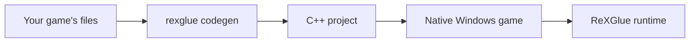

# ReXGlue SDK

ReXGlue turns Xbox 360 games into native Windows programs. It translates a
game's PowerPC code into C++ ahead of time, then supplies the parts of the
console the game expects: kernel, memory, graphics, audio, input, saves and
the Xbox 360 Guide.

It builds for **Xbox on PC** and the **next-generation Xbox (Project Helix)
app**, using Microsoft's own Xbox 360 backward compatibility as the guide for
how a game should look and behave.

> Status: alpha. Expect breaking changes.

## How it works


```mermaid
flowchart LR
  A[Your game's files] --> B[rexglue codegen]
  B --> C[C++ project]
  C --> D[Native Windows game]
  D --> E[ReXGlue runtime]
```

1. `rexglue init` creates a project for a game.
2. `rexglue codegen` translates the game's code to C++.
3. CMake builds it against the ReXGlue runtime into a Windows executable.
4. The player points it at their own copy of the game the first time it runs.

No game files are included in this repository or in anything built from it.

## Build the SDK

You need Windows 11 x64, Visual Studio 2026 with Clang, CMake, Ninja and the
Microsoft GDK. From a Visual Studio x64 developer prompt:

```powershell
git clone --recurse-submodules https://github.com/furqanagwan/rexglue-sdk.git
cd rexglue-sdk
cmake --preset win-amd64-gdk -DREXGLUE_BUILD_TESTS=ON
cmake --build --preset win-amd64-gdk-release
ctest --preset win-amd64-gdk-release --output-on-failure
cmake --install out/build/win-amd64-gdk --config Release
```

Exact tool versions are in [GDK toolchain](docs/gdk-toolchain.md).

## Make a game project

```powershell
rexglue init --project-name MyGame --xex-path D:/Games/MyGame/default.xex --game-root D:/Games/MyGame --project-root D:/Projects/MyGame
cd D:/Projects/MyGame
rexglue codegen
cmake --preset win-amd64-release -DCMAKE_PREFIX_PATH=<path to the installed SDK>
cmake --build --preset win-amd64-release
```

A working example is [furqanagwan/007](https://github.com/furqanagwan/007),
which builds the three Xbox 360 James Bond games.

## Where things are

| Folder | What it holds |
| --- | --- |
| `src/codegen` | PowerPC to C++ translation |
| `src/system`, `src/kernel` | The console's runtime and kernel |
| `src/graphics` | Xbox 360 graphics on Direct3D 12 |
| `src/audio`, `src/input`, `src/filesystem` | Sound, controllers, files and saves |
| `src/ui` | Window, presenter and overlays |
| `thirdparty/xbox` | The Xbox 360 Guide ([its own repo](https://github.com/furqanagwan/xbox)) |
| `tests` | Unit and instruction tests |
| `docs` | Design notes, decisions and test evidence |

## Contributing

Read [AGENTS.md](AGENTS.md) and [CONTRIBUTING.md](CONTRIBUTING.md). Work on a
branch and open a pull request; `main` only changes through reviewed PRs with
a passing build.

What has actually been tested is in [release evidence](docs/release-evidence.md).

## License and credits

See [LICENSE](LICENSE). Not affiliated with or endorsed by Microsoft or Xbox.

ReXGlue builds on [upstream ReXGlue](https://github.com/rexglue/rexglue-sdk)
(founded by [Tom](https://github.com/tomcl7), with
[Loreaxe](https://github.com/Loreaxe), [mystixor](https://github.com/Mystixor),
[Graine25](https://github.com/Graine25), [mrcmunir](https://github.com/mrcmunir),
[sanjay900](https://github.com/sanjay900), [Toby](https://github.com/TbyDtch),
[Roxxsen](https://github.com/Roxxsen) and the wider community),
[Xenia](https://github.com/xenia-project/xenia),
[Xenia Canary](https://github.com/xenia-canary/xenia-canary),
[Xenia Edge](https://github.com/has207/xenia-edge),
[XenonRecomp](https://github.com/hedge-dev/XenonRecomp) and
[rexdex's recompiler](https://github.com/rexdex/recompiler).
