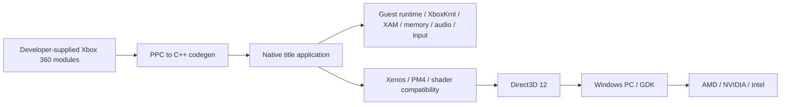

# ReXGlue SDK — Windows/GDK modernization fork

ReXGlue converts Xbox 360 PowerPC code into C++ ahead of time and provides the
runtime services needed by the resulting native title applications. This fork
targets **Windows PC, Microsoft GDK April 2026, and Direct3D 12**, with validation
across compatible AMD, NVIDIA and Intel GPUs.

**Status:** early-development modernization of upstream ReXGlue v0.10.0
(`c94f5ebdcb3c9d1a460ca48e04f9758448f8d518`). Windows is the only supported
host (Linux and macOS retired by RG-GDK-024) and Direct3D 12 is the only
graphics backend (Vulkan removed by RG-GDK-023). The SDK requires Windows x64
and the April 2026 PC GDK (260404); GDK-free builds are retired by
[ADR-016](docs/adr/ADR-016-required-pc-gdk.md). Project Helix is a future
validation target. One title (Quantum of Solace)
runs its recorded scene on NVIDIA. GDK packaging works for a minimal title. The
native Win32 window, XAudio2 and GameInput (with XInput for compatible pads) are the
only backends; SDL3 was removed (RG-GDK-033). AMD/Intel GPUs,
other titles and fresh machines are not validated. Each claim and its evidence
is in [release evidence](docs/release-evidence.md), including the current Debug
tessellation fixture failure. Public APIs may change.

## Purpose and architecture

Guest CPU code is statically recompiled. A title project builds the generated
C++ and registers its functions with the runtime; this is not a general-purpose
XEX launcher with a PPC interpreter/JIT fallback. GPU shader translation remains
part of Xenos compatibility and is separate from CPU recompilation.


```mermaid
flowchart LR
  G[Developer-supplied Xbox 360 modules] --> R[PPC to C++ codegen]
  R --> T[Native title application]
  T --> K[Guest runtime / XboxKrnl / XAM / memory / audio / input]
  T --> X[Xenos / PM4 / shader compatibility]
  X --> D[Direct3D 12]
  D --> W[Windows PC / GDK]
  W --> V[AMD / NVIDIA / Intel]
```

Preserve guest semantics above host APIs: native Windows/GDK services do not
automatically implement Xbox 360 kernel, XAM, XMA, profiles or storage behavior.
See [architecture plan](docs/architecture-plan.md) and [decisions](docs/adr/README.md).

| Channel | CI | Download |
| --- | --- | --- |
| Release | [](https://github.com/rexglue/rexglue-sdk/actions/workflows/build-win-amd64.yaml) | [Latest stable](https://github.com/rexglue/rexglue-sdk/releases/latest) |
| Nightly | [](https://github.com/rexglue/rexglue-sdk/actions/workflows/nightly.yaml) | [Latest pre-release](https://github.com/rexglue/rexglue-sdk/releases?q=prerelease%3Atrue) |

## Repository relationships

* [furqanagwan/rexglue-sdk](https://github.com/furqanagwan/rexglue-sdk) is the
  implementation and issue target.
* [Upstream ReXGlue](https://github.com/rexglue/rexglue-sdk) supplies the static
  SDK foundation, inspired by XenonRecomp and rexdex's recompiler.
* [Xenia](https://github.com/xenia-project/xenia),
  [Canary](https://github.com/xenia-canary/xenia-canary) and
  [Edge](https://github.com/has207/xenia-edge) are compatibility research sources.
* [furqanagwan/xenia-edge](https://github.com/furqanagwan/xenia-edge) is a
  controlled reference/experiment fork, not a dependency required to run ReXGlue.
* [furqanagwan/xbox-guide](https://github.com/furqanagwan/xbox-guide) owns the
  Guide and native XUI layer. This SDK pins its sources as a submodule and
  supplies the complete Guide's host services.
* Title repositories, such as [furqanagwan/007](https://github.com/furqanagwan/007),
  hold each game's configuration and investigation records, never game files.
  New ones follow the [title repository standard](docs/title-repo-standard.md).

For the Windows D3D12 compatibility baseline and the first Quantum of Solace
runs, see [baseline capture](docs/baseline-capture.md). As of 2026-09-27 Quantum
of Solace boots to early 3D views and runs a 90 s soak on the standard build
(XInput, the Win32 window and XAudio2) and on a GDK build (GameInput instead of
XInput). This is
a scene result, not gameplay: interactive progress is tracked in the 007
repository.
For the April 2026 GDK PC capability map and issue ownership, see the
[GDK capability audit](docs/gdk-2604-capability-audit.md).
For contributor boundaries, review gates and the current SDK work queue, see
[development guidance](docs/development.md) and the
[ecosystem maturity audit](docs/sdk-maturity-audit-20261007.md).
NVIDIA is the primary local GPU target. The synthetic getBCF fixtures also pass
on this machine's Intel integrated GPU; that does not establish general Intel
title compatibility. AMD GPU coverage remains non-blocking and untested under
[ADR-007](docs/adr/ADR-007-local-gpu-validation-scope.md).

For quick start guide, full CLI reference, and config file options, see the [wiki](https://github.com/rexglue/rexglue-sdk/wiki).

For XMA decode errors, optional private packet captures and the `xma_probe`
diagnostic tool are described in the [XMA stream investigation](docs/xma-cross-buffer-streams.md).

Codegen recognizes a verified CRT `setjmp`/`longjmp` pair without per-title
addresses. Explicit overrides remain authoritative. Native jumps require guest
register localization to be disabled; unsupported jump paths fail explicitly.
See the [scope and validation record](docs/crt-nonlocal-jumps.md) before relying
on this for a title's save/exit or error recovery.

ReXGlue has independent Git history containing adapted Xenia-derived source.
There is no proven single Xenia base revision for the entire initial import.
The [ancestry analysis](docs/investigation.md) records exact reachable tips,
historical boundaries and later source imports. Upstream repositories are not
modified by this fork's roadmap work.

## Requirements

Current Windows x64 developer workflow requires Git with submodules, CMake 3.25
or newer, Ninja, LLVM Clang 18 or newer with C++23 support, Visual Studio C++
build libraries and a Windows SDK. Use an x64 Visual Studio developer shell so
Clang can find CRT libraries. The preset `win-amd64` denotes CPU architecture;
it does **not** restrict the GPU to AMD.

D3D12 device creation currently requests feature level 11_0 and queries optional
features. That is not a promise that every FL11_0 GPU supports every rendering
path or title. See the [capability/vendor matrix](docs/regression-strategy.md).
No AMD/NVIDIA/Intel compatibility certification has been completed here.

PPC instruction tests use bundled `tools/binutils/powerpc-none-elf-as.exe`,
`powerpc-none-elf-ld.exe`, `powerpc-none-elf-nm.exe` and their runtime DLLs.
The FFmpeg submodule is part of XMA decoding; do not replace it with an arbitrary
system FFmpeg build; the pin and its differences from Edge's are recorded in
[XMA audit](docs/xma-audit.md). Vulkan SDK is not required for the documented D3D12-only
Windows configuration.

## Build and install the current SDK

From an x64 Visual Studio developer shell:

```powershell
git clone --recurse-submodules https://github.com/furqanagwan/rexglue-sdk.git
cd rexglue-sdk
git submodule update --init --recursive
cmake --preset win-amd64-gdk -DREXGLUE_BUILD_TESTS=ON
cmake --build --preset win-amd64-gdk-debug
ctest --preset win-amd64-gdk-debug --output-on-failure --no-tests=error
cmake --build --preset win-amd64-gdk-release
ctest --preset win-amd64-gdk-release --output-on-failure --no-tests=error
cmake --install out/build/win-amd64-gdk --config Release
```

Install prefix defaults to `out/install/win-amd64-gdk`. The historical
[fresh-checkout evidence](docs/release-evidence.md#fresh-checkout-2026-09-27)
predates the GDK-only policy; it does not establish a fresh GDK installation.
The D3D12
and Vulkan flags are accepted for compatibility: D3D12 is always on, and
turning Vulkan on stops configuration. Unit tests are disabled unless
`REXGLUE_BUILD_TESTS=ON`; CTest discovering zero tests is not validation.

## GDK setup and target

Install the public PC April 2026 GDK through Microsoft's supported distribution,
plus its required Windows SDK and supported Visual Studio toolchain. Pin the
exact 2604 update and redistributables in your build record. The
[official April announcement](https://developer.microsoft.com/en-us/games/articles/2026/04/april-2026-microsoft-gdk-update/)
names VS 2026 Professional/Enterprise support; the
[release notes](https://learn.microsoft.com/en-us/gaming/gdk/docs/gdk-dev/whatsnew/release-notes?view=gdk-2604)
distinguish PC GDK from console extensions. Do not infer toolchain support from
an installed directory alone.

The required `win-amd64-gdk` preset builds and tests the SDK against the
installed `260404` edition and installs a package whose consumers resolve the
GDK on their own machine; see [GDK toolchain](docs/gdk-toolchain.md) for the
pinned versions, commands, results and what is not yet established (supported
VS edition, clean machine). `win-amd64` is now a compatibility alias pointing
to the same GDK build/install directories. `REXGLUE_USE_GDK=OFF` is rejected.
`win-amd64-gdk-dxil` adds the opt-in DXIL shader toolchain (Mesa
`spirv_to_dxil`, D3D12 Agility SDK 1.618.5, DXC 1.8.2502.8, the pairing
Microsoft's PC backward compatibility ships); see [DXIL shader toolchain](docs/shader-dxil.md).
The SDK reads pads through GameInput
(`input_backend`): see [GameInput driver](docs/gameinput.md).
Pads GameInput does not list, such as Bluetooth LE pads, come through
XInput beside it, and the guide shows a wireless pad's battery level.
Every input backend honours `vibration`, `left_stick_deadzone_percentage`
and `right_stick_deadzone_percentage`, and `mnk_passthrough` presents the
keyboard to titles that read one.
Every build uses the native Win32 window (`ui_backend = "win32"`) and XAudio2
(`audio_backend = "xaudio2"`) by default: see [Windowing](docs/windowing.md)
and [Audio output](docs/audio-output.md).
The window applies `monitor`, `window_width`/`window_height`, `resolution`
and `fullscreen` without a restart, and `fullscreen_exclusive` switches the
display mode instead of going borderless.
GDK titles own the Gaming Runtime (`gaming_runtime = "auto"`, `"required"` or
`"off"`), `rexglue init gameconfig` writes a PC `MicrosoftGame.config` from the
title's own identity, and the pinned `makepkg`/`wdapp` commands register,
package, install and remove a title: see [Gaming Runtime and PC packaging](docs/gdk-packaging.md).
Do not put restricted SDK headers/docs or real service credentials in this repo.
DXC, DirectStorage, XAudio2 and GameInput are evaluated at the host boundary;
none replaces the corresponding guest semantics by itself.

## Create, generate and run a title project

Use only legally obtained title material, stored outside this repository. The
CLI has `init`, `codegen` and `recompile-tests` commands. With the installed SDK
CLI on PATH, an example project initialization is:

```powershell
rexglue init --project-name MyTitle --xex-path 'D:/PrivateGames/MyTitle/default.xex' --game-root 'D:/PrivateGames/MyTitle' --project-root 'D:/Projects/MyTitle'
cd D:/Projects/MyTitle
rexglue codegen
cmake --list-presets
```

`codegen` auto-discovers the generated manifest in the working directory; use
`rexglue codegen --help` and `rexglue init --help` for options. Configure/build
the generated title's own presets, set `CMAKE_PREFIX_PATH` to the installed
ReXGlue prefix (or `REXSDK_DIR` to this source tree). The build copies
`rexruntime.dll` and the D3D12 GPU plugin (`GPU_PLUGINS xenos` in the generated
`CMakeLists.txt`) beside the executable. GPU emulation is off unless the plugin is
named at startup:

```powershell
.\my_title.exe --game_data_root=D:/PrivateGames/MyTitle --user_data_root=D:/Saves/MyTitle --gpu_plugin=xenos
```

Both paths are optional: by default the title finds its game files in a `game`
folder beside the executable (or the executable's own folder), keeps saves in
`Saved Games\<name>` and caches, logs and settings in `%LOCALAPPDATA%\<name>`,
as an Xbox PC game does ([data locations](docs/data-locations.md)).
Rebuilt hosts can opt into pre-launch graphics/audio/language settings with
`--launch_menu=true`. `rexglue title-art` generates native EXE icons and GDK
images from local title art; see [PC backward compatibility coverage and gates](docs/pc-backward-compatibility.md).
This is how the Quantum of Solace baseline runs. Add `--input_backend=gameinput`,
`--ui_backend=win32` and `--audio_backend=xaudio2` for the native paths (GameInput
needs a GDK build). `rexglue init gameconfig` adds a `MicrosoftGame.config` for
GDK packaging. This is not a
promise that an arbitrary XEX recompiles without title-specific analysis.
Additional guest DLLs must also be statically generated and registered; see
`rexglue init module --help`. Guest code patches (for example a Canary
game-patches entry) go in the codegen config as `[[patch]]` tables and are
compiled in ([code patches](docs/code-patches.md)); recompile after changing one.
A title update is built as a second executable, `<title>_tu<version>`, from its
package and its own config: a manifest `[[title_update]]` entry
([title updates](docs/title-updates.md)).

### PC launch and game sources

The existing Xbox 360 Guide remains the presentation for in-game features.
An optional host settings screen is available with `--launch_menu=true` for
graphics, audio and language settings before launch. Regenerated titles also validate the original source executable and
offer a first-run folder/ISO/disc selector, optional cancellable extraction
and Retry/Leave Game on media read failure. Sources use checked file I/O;
source/recovery choices and copy progress use the console scenes when Guide
assets are available. Physical drive, painted scene and real-title checks remain.
See [PC experience and remaining gates](docs/pc-backward-compatibility.md).

### Xbox guide

The Guide is maintained in [furqanagwan/xbox-guide](https://github.com/furqanagwan/xbox-guide),
with its own issues and reusable XUI scene target. This SDK consumes a pinned
`thirdparty/xbox-guide` submodule; use `git submodule update --init --recursive`
after updating. The complete Guide uses ReXGlue services; other recomp SDKs can
reuse the scene layer and adapt the host services. See the
[extraction and issue ownership](docs/xbox-guide-extraction.md).
The [2026-10-07 issue audit](docs/guide-issue-audit-20261007.md) distinguishes
closed Guide work from outstanding acceptance checks and title rebuild evidence.

Press View and Menu together (Back and Start on an Xbox 360 pad), or Home on
the keyboard, to open the Xbox 360 guide over the running title, as Xbox backward
compatibility does. The Xbox button is left to Windows for Game Bar. The guide is the console's own: its scenes, animations and sounds are read
from your own dashboard 2.0.17559 system update, and nothing from it ships with
the SDK. Set `REXGLUE_SYSTEM_UPDATE` to that `$SystemUpdate` folder when you
build a title (CMake variable or environment variable) and the guide is built into
the executable: players need nothing and it works offline. Xbox 360 presentation
is the default and ignores a configured `REXGLUE_GUIDE_FLASH` path. An original
Xbox host explicitly selects `GUIDE_PRESENTATION original-xbox` and supplies its
own BC `Content/Flash` assets. The Guide mode does not add original Xbox game
execution; see [Guide presentation](docs/adr/ADR-015-guide-presentation-by-title.md).
Games & Apps has the title's achievements (grid and details) and Manage Game,
which lists the title's marketplace add-ons (its config's `[[dlc]]`; the build
fetches their names, descriptions and art) and installs them from packages on
this PC. Leave Game (Y, or the Home tab) ends the title after a confirmation.
The guide has three tabs, Games & Apps, Home (titled with the gamertag of the Xbox account signed in to Windows) and
Settings, as the Xbox One and Series consoles' guide has for 360 titles.
Settings > Preferences sets notifications, game volume, vibration and the render
resolution (by default the title's own, as on the console; 2x, 3x and Match
Display are experimental and much slower); Settings > Patches and Mods turn a title's switchable code
patches on and off while it runs, and Settings > Cheats lists the codes the
game itself takes. See [Xbox guide](docs/xbox-guide.md).

## Repository structure

| Path | Responsibility |
| --- | --- |
| `src/codegen`, `include/rex/codegen`, `include/rex/ppc` | PPC analysis, C++ generation, guest ABI |
| `src/system` | Runtime, function dispatcher, XEX, memory and guest objects |
| `src/kernel` | XboxKrnl and XAM exports |
| `src/graphics`, `src/ui/d3d12` | Xenos/PM4/shaders and D3D12 rendering/presentation |
| `src/audio`, `src/input`, `src/filesystem`, `src/core` | Guest services and host mechanisms |
| `src/rexglue`, `resources` | CLI and generated project templates |
| `tests/unit`, `tests/ppc` | Unit tests and generated instruction validation |
| `cmake`, `thirdparty`, `.github` | Build, pinned dependencies, installation and workflows |
| `docs` | Architecture, evidence, roadmap, regression and handoff records |

## Testing and compatibility status

Only one title has been run locally: Quantum of Solace (`415607FF`) passes its
boot and early-rendering scene. Menus, controlled input, gameplay and saves have
not been run. Do not infer results from Canary/Edge reports. The
[baseline strategy](docs/regression-strategy.md) lists the representative
workloads with each one's owner and current result (most run as synthetic
fixtures), plus record fields, the vendor matrix and comparison thresholds.

GPU changes require deterministic buffer/shader tests and recorded runs on AMD,
NVIDIA and Intel. Test Intel Arc/non-Arc separately. Include driver, Windows,
GDK, exact SDK/title commits, module hashes, config, selected rendering path,
screenshots/logs and PIX/DRED where useful. Unavailable material/hardware remains
blocked, never a pass. A project that builds has not thereby passed compatibility.

## Troubleshooting

| Symptom | Check |
| --- | --- |
| Missing `oldnames.lib` / `msvcrtd.lib` | Enter x64 VS developer shell; verify C++ tools and Windows SDK |
| “submodule is not initialized” | Run recursive submodule initialization at pinned commits |
| Missing PPC assembler | Check bundled binutils executables and their DLLs; do not disable required tests to claim success |
| No CTest tests | Configure with `REXGLUE_BUILD_TESTS=ON`; inspect actual discovery |
| Version falls back to dev/unknown | Check reachable release tags; fetch upstream tags deliberately and do not publish them blindly |
| GPU plugin missing or duplicate state | Use installed runtime/plugin layout; do not relink core object libraries into the plugin |
| Device removal / corruption | Record capabilities/driver/path; gather debug-layer/DRED/PIX evidence against baseline ([PIX captures](docs/baseline-capture.md#pix-for-windows-captures-rg-gdk-028)) |
| Missing guest function / module | Generate/register the target module and inspect imports; there is no JIT fallback |
| Audio loop/scene stalls | Preserve decoder/FFmpeg/config evidence; do not mask decode errors with silence |
| GDK launch/package failure | Follow [Gaming Runtime and PC packaging](docs/gdk-packaging.md); the log names the runtime state (missing, version mismatch, config error, timed out) |
| `Microsoft Visual C/C++ Version differs in precompiled file` | Visual Studio updated its toolset; clean the preset (`cmake --build --preset <p> --target clean`) and rebuild |
| `GPU plugin 'xenos' not found` | Stage the plugin with `GPU_PLUGINS xenos` in `rexglue_setup_target` (generated projects do) and rebuild |
| Title exits `0xC0000139` (entry point not found) | Another SDK's `rexruntime.dll` is being loaded from `PATH`; ship the title's own DLLs beside it |
| Crash at startup with `input_backend = "gameinput"` | Fixed in PR #82 (guide-button callback corrupted the driver); update the SDK |

## Roadmap, upstream review and contributing

[Roadmap and live issue index](docs/roadmap.md) contains sequential RG-GDK IDs,
dependencies and readiness. The RG-GDK-001 baseline is established (see
[baseline capture](docs/baseline-capture.md)); the kernel-lifetime and timing
work (RG-GDK-014, then RG-GDK-015) and title profiles (RG-GDK-013) build on it.

Read the [investigation](docs/investigation.md),
[open/closed upstream analysis](docs/upstream-review.md),
[provenance ledger](docs/upstream-tracking.md) and
[ADRs](docs/adr/README.md). Review Canary/Edge monthly and before each port,
including rejected PRs and follow-up regressions. No automatic upstream merge.
Title-specific behavior requires explicit traceable scope and disable controls.
Vulkan/Linux/macOS removal (done in RG-GDK-023/024) followed replacement → baseline → default switch →
regression validation → removal → validation again.

Humans and coding agents use [AGENTS.md](AGENTS.md) as canonical instructions.
Follow [CONTRIBUTING.md](CONTRIBUTING.md), preserve licenses/authorship, use focused
changes, and publish evidence against the assigned issue. `agent-ready` is earned
only with completed dependencies, settled architecture, reviewed upstream work
and measurable tests. Never mark a migration done on compilation alone.

For documentation/roadmap changes:

```powershell
python scripts/validate_roadmap.py
git diff --check
```

## License and attribution

See [LICENSE](LICENSE) and retained third-party notices. This independent project
is not affiliated with or endorsed by Microsoft/Xbox. Do not distribute game
content or restricted SDK material. Upstream credits are preserved below.

# Credits

## ReXGlue
- [Tom (crack)](https://github.com/tomcl7) - Project Founder
- [Loreaxe](https://github.com/Loreaxe) - Linux Contributor
- [mystixor](https://github.com/Mystixor) - Windows Contributor
- [Graine25](https://github.com/Graine25) - Project Support
- [Carlos Estrague (mrcmunir)](https://github.com/mrcmunir) - Linux / ARM64 Contributor
- [sanjay900](https://github.com/sanjay900) - Linux / SDL Contributor
- [Toby](https://github.com/TbyDtch) - Project Support
- [Roxxsen](https://github.com/Roxxsen) - CI/CD Contributor

The list above is not exhaustive. Thanks to everyone in the ReXGlue community who contributes code, files issues, tests builds, and keeps the project moving.

## Very Special Thank You:
- [Project Xenia](https://github.com/xenia-project/xenia/tree/master/src/xenia) - Their invaluable work on Xbox 360 emulation laid the groundwork for ReXGlue's development. This project (and numerous others) would not exist without their hard work and dedication.
- [XenonRecomp](https://github.com/hedge-dev/XenonRecomp) - For pioneering the modern static recompilation approach for Xbox 360. A lot of the codegen analysis logic and instruction translations are based on their work. Thank you!
- [rexdex's recompiler](https://github.com/rexdex/recompiler) - The OG static recompiler for Xbox 360. 
- Many others in the Xbox 360 homebrew and modding communities whose work and research have contributed to the collective knowledge that makes projects like this possible.
