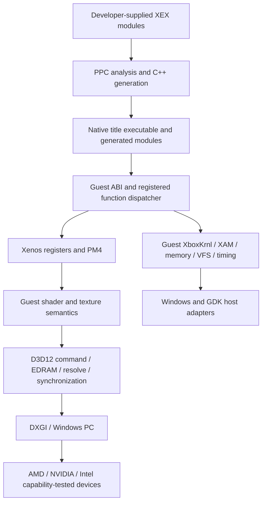

# Architecture and migration plan

Accepted destination: Windows PC, Microsoft GDK April 2026, D3D12 only,
statically recompiled Xbox 360 CPU code. GPU shader translation at runtime is
compatible with this boundary; runtime PPC JIT compilation is not.

## GPU/Xenos sequence

1. Record a D3D12 baseline and synthetic shader/PM4/readback fixtures. The removed
   Xenia GPU trace system is not a working local test tool. Design a minimal legal
   fixture harness before promising capture replay.
2. Port independent arithmetic/address defects: signed memexport bias, texture
   layouts, sub-32bpp resolve offsets. Assert exact bytes against independently
   calculated addresses; test both host-RT and ROV paths where available.
3. Treat canonical EDRAM, alias tracking, sample layout and transfer shader
   regeneration as one coordinated migration. Canary #1163 without #1238 is an
   explicitly documented AMD regression hazard. #1222 is a related alias fix.
4. Implement real ZPD counters separately from VIZ predication. Current synthetic
   reports have observable behavior that must be baselined. Model BEGIN/END,
   running counter subtraction/wrap, guest endian layout, queued report writes,
   query reuse, resolution scaling and submission fences. Strict mode is the
   correctness reference; fast modes must carry documented semantic differences.
5. Audit memory export/readback across CPU and GPU ownership. A rendering-only
   screenshot cannot prove CPU-visible exported memory is coherent.
6. Evaluate Edge's SPIR-V→DXIL path in an isolated experiment. Edge
   [`c00e7aead`](https://github.com/has207/xenia-edge/commit/c00e7aead)
   retires DXBC including transfer generators, and
   [`6e9cb7e3f`](https://github.com/has207/xenia-edge/commit/6e9cb7e3f)
   removes its dxcompiler.dll dependency. This is not simply switching a compiler
   flag. ReXGlue's D3D12 generator emits DXBC directly. Compare signed zeros,
   NaNs/Infs, scalar approximation, texture swizzles, memexport, depth exports,
   ROV interlocks and pipeline cache identities before choosing the new path.

D3D12-only means the host rendering API, not a ban on a shader intermediate
representation. Initial implementation retains DXBC. If a later ADR adopts
SPIR-V as backend-independent IR, retain only demonstrated compiler dependencies,
without a Vulkan loader, surface, presenter, device or runtime backend.
Native Microsoft DXC is appropriate for HLSL→DXIL assets where measured useful;
it is not a drop-in replacement for guest instruction translation.

Keep `rexgpu-xenos` as the current runtime-loaded plugin while preserving its ABI.
`src/graphics/CMakeLists.txt` deliberately links `rexruntime` instead of duplicating
core/UI object libraries and global state. D3D12-only does not require destroying
that separation or adding a runtime dependency on the controlled Edge repository.

## Capability and driver policy

Existing provider creates FL11_0 devices and checks ROV, programmable sample
positions, stencil reference and other options. Device creation alone is not
proof of the required rendering path. Log adapter LUID, PCI IDs, driver,
feature level, shader model, binding tier, ROV, sample positions, relevant format
support and selected path. Query optional features with `CheckFeatureSupport`;
unsupported features get a tested fallback or an explicit diagnostic.

Current RT selection contains historical Intel/AMD conditions and an Intel
native stencil switch. Preserve them until tests establish whether each driver
range still needs them. Each exception needs upstream provenance, affected
hardware/driver range, enabling condition, fallback and retirement test. Never
replace evidence with vendor-name assumptions. Include PIX markers, D3D12 debug
layer and DRED capture on device removal; evaluate GPU-based validation separately
from performance runs. See the [vendor matrix](regression-strategy.md).

## Guest services and native host boundaries

XboxKrnl: retain guest memory layouts, status codes, object ownership, handle
reuse and wait/APC ordering. Port the NtOpenFile ABI fix first; then object header
synchronization and IO completion semantics. Edge's cooperative scheduler uses
emulator execution/safepoints and cannot be transplanted into generated native
functions. A future scheduler requires its own static safe-point/unwind design.

XAM: compare exports and structures one at a time against `export_table.inc`.
Implement real content flush, case handling, profile persistence, notifications
and module transitions before UI polish. GDK sign-in, achievements or cloud
storage are distinct host services; they do not implement Xbox 360 XAM by sharing
a similar name. Guest relaunch can load only precompiled modules registered by
the title project; unknown code must fail visibly rather than invoke a JIT.

Audio: keep XMA context registers, decoder packet traversal, guest callbacks,
loop/subframe consumption and FFmpeg pin separate from the output sink. Add an
XAudio2 PCM output adapter with exact channel order, endian conversion, backpressure,
device-loss recovery and shutdown tests. No plan assumes Windows XAudio2 is an
automatic replacement for the existing guest XMA decoder. Upstream #1214 is
useful lock/lifetime research but its exact lock graph differs from local code.

Input: implement GameInput behind the existing driver interface. Preserve four
guest slots, packet numbers, reconnect identity, rumble, deadzones, focus behavior,
keyboard/mouse merging and specialty-device subtype reporting. Existing XInput
is the Windows comparison path until parity is demonstrated; SDL cannot be
removed while it still owns windowing or audio.

Timing/storage: native QPC and Windows waits implement host mechanisms, while
Xbox 360 scheduling and storage completion remain guest contracts. DirectStorage
is an optional optimization for appropriate host reads, not an NT/VFS replacement.
Edge's UEFA timing work shows why making reads faster may reduce compatibility.
Avoid global sleeps inferred from one title. Prototype a per-device completion
model with explicit profiles only after observing a local reproducer.

## April 2026 GDK capability matrix

Target the public **PC** GDK, not restricted GDKX console APIs. Pin the exact
2604 update, redistributables, Windows SDK, compiler and packaging tools in the
future build manifest. April 2026 Update 4 appears in the public release notes;
the installed `260404` directory is not proof of a configured or tested SDK build.

| Capability | Existing state | Proposed use / validation gate |
| --- | --- | --- |
| D3D12/DXGI | Implemented Windows backend | Required renderer; preserve semantics and capability fallbacks |
| DXC/DXIL | Guest translation currently DXBC | Separate shader architecture experiment; pin compiler/validator if adopted |
| Gaming Runtime | No integration found in source | Application-owned initialize/uninitialize; handle missing/mismatched runtime, package identity and shutdown |
| MicrosoftGame.config | No title packaging flow established | Generated per-title PC configuration using real project identity; never invent Partner Center IDs |
| VS/toolchain | CMake requires Clang ≥18 and C++23 | Prove supported VS 2026/Windows SDK libraries with Clang-built runtime; no silent MSVC codegen switch |
| GameInput | SDL/XInput/mouse-keyboard drivers | New host adapter; reconnect, slots, rumble and subtype tests |
| XAudio2 | SDL PCM output + FFmpeg XMA | New PCM sink; channel/latency/recovery parity before default switch |
| DirectStorage | Conventional host VFS reads | Optional later acceleration; preserve guest completion ordering and storage timing |
| PIX/DRED | Existing graphics diagnostics hooks | Capture reproducible GPU failures and package-file mapping; versioned tool instructions |
| Packaging/deployment | CMake SDK install exists | Add title package smoke and install/launch/uninstall test; ordinary Windows development remains supported |
| MSIXVC2 / ARM64 | Not validated | April release previews; exclude from initial x64 production gate |
| Storage/profiles | Xbox 360 content model | Preserve guest save contract; host cloud service integration is separate optional work |
| Memory/threading/timing | Win32 and guest abstractions | Keep guest address/ABI rules above VirtualAlloc/waits/QPC; do not invent GDK equivalents |

Official public references checked September 23, 2026:

* [April 2026 announcement](https://developer.microsoft.com/en-us/games/articles/2026/04/april-2026-microsoft-gdk-update/)
  confirms VS 2026 Professional/Enterprise support and identifies MSIXVC2/native
  ARM64 as previews. Do not infer Community certification from local installation.
* [April 2026 release notes](https://learn.microsoft.com/en-us/gaming/gdk/docs/gdk-dev/whatsnew/release-notes?view=gdk-2604)
  distinguish public PC GDK from console extensions and list updates.
* [Gaming Runtime initialization](https://learn.microsoft.com/en-us/gaming/gdk/docs/reference/system/xgameruntimeinit/xgameruntimeinit_members?view=gdk-2604)
  documents `XGameRuntimeInitialize`, `XGameRuntimeUninitialize` and failure codes.
* [MicrosoftGame.config](https://learn.microsoft.com/en-us/gaming/gdk/docs/features/common/game-config/microsoftgameconfig-overview)
  describes platform-specific game configuration; packaging belongs to the title app.
* [GameInput](https://learn.microsoft.com/en-us/xbox/gdk/docs/features/common/input/overviews/input-overview?view=gdk-2604)
  documents PC availability through NuGet; do not assume a GDK include alone deploys it.
* [XAudio2 introduction](https://learn.microsoft.com/en-us/windows/win32/xaudio2/xaudio2-introduction)
  is the public host audio reference.
* [D3D12 feature levels](https://learn.microsoft.com/en-us/windows/win32/direct3d12/hardware-feature-levels)
  distinguishes feature level from optional capability queries and performance.
* [DRED enablement](https://learn.microsoft.com/en-us/windows/win32/api/d3d12/ne-d3d12-d3d12_dred_enablement),
  [DirectStorage samples](https://github.com/microsoft/DirectStorage), and
  [DXIL design](https://github.com/microsoft/DirectXShaderCompiler/blob/main/docs/DXIL.rst)
  supply diagnostics/storage/compiler references. These do not prove ReXGlue integration.

## Removal dependency map and build migration

| Removal target | Dependencies / consumers to audit | Replacement and exit gate |
| --- | --- | --- |
| Vulkan renderer | `src/graphics/vulkan`, `src/ui/vulkan`, public headers, graphics/UI plugin selection | D3D12 PM4, RT, texture, presenter and dialogs pass baseline |
| Vulkan libraries | `thirdparty/CMakeLists.txt`, `.gitmodules`, `cmake/rexglue_vulkan_stack.cmake`, install/export config | No runtime Vulkan imports or packaged loader; distinguish shader IR tooling decision |
| SPIR-V/glslang/VMA/MoltenVK | Shader generators, headers, submodules, install rules, generated bytecode | Remove only after shader decision identifies actual consumers; VMA/MoltenVK are backend-specific |
| Linux | `*_posix.cpp`, `surface_gnulinux.cpp`, Linux presets and workflows, packaging | Windows counterparts verified; POSIX files shared with macOS considered together |
| macOS | `surface_mac.cpp`, Objective-C language selection, mac presets/workflows, Metal surface/MoltenVK | Win32 window/presenter/clipboard/dialog parity; no Apple build targets or packages |
| SDL (optional native migration) | UI windows/main loop, audio, input, dialogs, `thirdparty/CMakeLists.txt` | Separate native replacements pass all consumers; Windows-only by itself is insufficient |
| Old abstractions | Public include API, generated consumer templates, exported CMake targets | Consumer rebuild and ABI test; retain guest/host boundary even with one host |

Order: replacement capability → validation → baseline comparison → default switch
→ regression runs → obsolete code/dependency removal → abstraction simplification
→ clean build/install/consumer/regression runs again. Do not start with deletion.

Use x64 initially (the existing preset name `win-amd64` means CPU architecture,
not an AMD GPU requirement). Add a pinned GDK configure preset only after a small
title app proves the toolchain and package flow. Keep the existing developer
workflow reproducible during transition. Update `_build-platform.yaml`, nightly
and release workflows, generated project presets, install exports and docs as
part of removal; simply deleting Linux workflow files is insufficient.

## Compatibility policy design

Canary/Edge use title-ID configuration files, hash-filtered patch databases and
title-aware helpers (`src/xenia/config.cc`, `src/xenia/patcher/{patch_db,patcher}`,
`kernel/xmp_volume_patch.*`). Some broad cvars implement game-motivated behavior.
Those mechanisms explain scope but do not establish correctness.

A ReXGlue profile design is justified for investigation, not immediate runtime
implementation. Require title ID **and module hash/version**, explicit named
behavior, source commit/issue, rationale, owner, tests, expiry/review condition,
default-off status unless verified, a disable switch and effective-profile logs.
Reject unknown keys and conflicting rules. Never persist a title override into
global defaults. A title transition clears old overrides. Guest instruction
patches must be applied before static code generation (or through an explicit
generated function override); writing new PPC bytes into memory cannot update
already-compiled C++.

ADR-005 settles that policy. Whether a runtime database is necessary and its
schema are gated by the profile-design roadmap issue, not silently implemented
as part of this documentation work.
