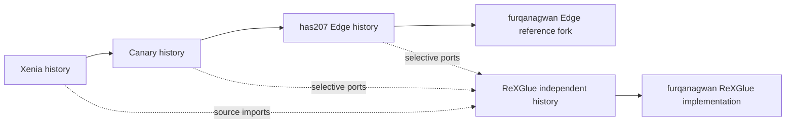

# Windows/GDK modernization investigation

Evidence snapshot: 2026-09-23. Implementation target: `furqanagwan/rexglue-sdk`.
This is a source investigation and implementation plan, not a completed runtime migration.

## Executive assessment

Preserve the static PPC-to-C++ toolchain, registered function dispatch, guest ABI,
guest address space and kernel contracts. Modernize the compatibility runtime in
small, independently reversible ports. Windows PC with the April 2026 GDK and
D3D12 is the accepted destination; current code still contains other platforms
and Vulkan. No game or GPU family is certified by this investigation.

Three small, source-confirmed defects should precede wholesale GPU work:

* `src/kernel/xboxkrnl/xboxkrnl_io.cpp:179` gives `NtOpenFile_entry` five
  parameters. Edge's [887beea6979fc1ee8580deb755d771c61e0039ad](https://github.com/has207/xenia-edge/commit/887beea6979fc1ee8580deb755d771c61e0039ad)
  restores ShareAccess in argument five and OpenOptions in argument six, and
  reports fixing Dead Rising disc errors. Adapt the typed import and test r7/r8
  independently; do not copy Xenia's import macros.
* `src/graphics/pipeline/shader/dxbc_translator_memexport.cpp:188,401`
  writes the rounding bias into the value register, then adds an unwritten
  temporary. [Canary #1127](https://github.com/xenia-canary/xenia-canary/pull/1127)
  repairs the temporary destination. Test signed packed exports and readback,
  not just generated shader compilation.
* `src/system/xmemory.cpp` rounds `high_address` up to allocation alignment.
  [Canary #1215](https://github.com/xenia-canary/xenia-canary/pull/1215)
  preserves the caller's ceiling while rounding the page bound. Test exact-fit
  windows and overflow near UINT32_MAX. Do not conflate this with pending
  [#1182](https://github.com/xenia-canary/xenia-canary/pull/1182)'s alignment semantics.

The highest-risk changes are real occlusion queries, canonical EDRAM layout,
shader translation replacement, guest scheduling, and XMA timing. The current
`EVENT_WRITE_ZPD` writes synthetic counts and `VIZ_QUERY` reports visibility;
newer upstream code adds materially different semantics and synchronization.
ReXGlue's March XMA import already incorporates Canary's decode/consume split
and merged guest context writes. Replacing it without comparison would lose
ReXGlue adaptations and could reintroduce bugs.

## Repository ancestry and divergence

These are full local histories, not shallow clones. GitHub parent metadata and
Git reachability were checked independently. Refs were fetched without changing
either checkout or any upstream repository. Counts include merge commits.

| Repository/ref | Pinned commit | Finding |
| --- | --- | --- |
| ReXGlue fork HEAD and upstream main | `c94f5ebdcb3c9d1a460ca48e04f9758448f8d518` | 0 fork-only, 0 upstream-only commits; v0.10.0 release commit |
| Controlled Edge fork checkout | `80a3b891de741f20ee034ccea7162ec6950138bf` | 0 fork-only, 7 upstream-only commits against fetched Edge |
| Upstream `has207/xenia-edge:edge` | `94de4f676dd21b778010a7431c6f7a7d76b42c8b` | Contains current Canary; 1,720 commits not reachable from Canary |
| `xenia-canary/xenia-canary:canary_experimental` | `c9c8e483b13249ba5f0060fc4b36071da6d67261` | Contains current Xenia master; 1,775 commits not reachable from master |
| `xenia-project/xenia:master` | `95a5c3ee250f80c3b9d139658649d9ffb6db3eec` | Commit dated 2026-02-18 |

Canonical parent chain from GitHub is ReXGlue fork → `rexglue/rexglue-sdk`, and
Edge fork → `has207/xenia-edge` → Canary → Xenia. `romatthe/xenia-edge` appears in
search results but is not the parent of this controlled fork. Follow the verified
parent, not search ranking.



Current merge-bases are the current parent tips because upstream merges continue.
They are not original fork dates. The oldest first-parent commit exclusive to
the current Edge history is
[`1e67bd53acb7df2881a15720fd4182b9030c9065`](https://github.com/has207/xenia-edge/commit/1e67bd53acb7df2881a15720fd4182b9030c9065),
parent `8d03766d039569e36539d19283ed14c5c2683b8d` (Vulkan resolution scaling;
author date August 27, committer date September 17, 2025).
The explicit Canary→Edge rename is
[`b11d194c44531cf8842bc9ca57a18e083c7a16f6`](https://github.com/has207/xenia-edge/commit/b11d194c44531cf8842bc9ca57a18e083c7a16f6)
on September 21, 2025. Older side-branch ARM64 commits in the exclusive set
do not establish an earlier Edge fork date.

Canary's oldest exclusive first-parent commit in these histories is
[`6012386d015f8d308fd9aecf107a52e1d77e7cc4`](https://github.com/xenia-canary/xenia-canary/commit/6012386d015f8d308fd9aecf107a52e1d77e7cc4),
parent `7675b6b14045b7c713d3ad2e664eef8a484b6185`. It has a 2019 author date
but a May 19, 2022 committer date and a May 2022 parent. This proves rewritten/
reapplied history, not an original 2019 branch point. Do not invent a single
historical divergence date from the author timestamp.

ReXGlue begins at root
[`96bf707d18366066a96f8a157b8e2d3ac8f22105`](https://github.com/rexglue/rexglue-sdk/commit/96bf707d18366066a96f8a157b8e2d3ac8f22105)
(author January 22, committer February 7, 2026). Loading ReXGlue objects into the
Edge comparison object database and running `git merge-base` against master
returns no common ancestor. Thus ReXGlue is a source-derived runtime, not a Git
branch of Xenia. The exact initial Xenia snapshot cannot be proved from this
root's message or graph; per-file provenance remains necessary.

Known subsequent imports establish useful bases rather than one global base:

| ReXGlue commit | Imported behavior and provenance |
| --- | --- |
| `4d3abf66235fd5123a3f9d667a16df93697e43b2` | PWL gamma/UNorm16; explicitly cites Xenia `cec9ca0ef2f1343070e6211478db37d4b4a8ad95`, `0a19234b4e6905f2cd249b4af6172ca4656c92de`, `c7f61342d7061b8264e4b988b8d2e03351b6e088` |
| `f20b3b2` | Edge register metadata, PM4 and Vulkan tessellation; no exact upstream SHA in message |
| `a0271ec` | Canary XMA decode/consume split, loops and StoreContextMerged; no exact upstream SHA in message |
| `30e1c8a` | XMA context synchronization port |
| `e6407f3a63e532365629ffb3176f863773d885ac` | D3D12 pipeline/command update; message lacks exact upstream revision |
| `71782a3` | ReXGlue removed GPU trace capture and Snappy; do not assume an upstream replay harness is currently usable |

No unique fork commits or initial working-tree edits were found in either
checkout. Preserve the static dispatcher, runtime/plugin ABI, generated project
templates, tests and ReXGlue's source adaptations even though they originated
upstream of this personal fork. Exclusive commit counts are not patch-uniqueness
counts: cherry-picks/backports can implement the same change under different SHAs.

At this snapshot there are **no Canary-only reachable commits relative to Edge**,
because Edge contains the whole pinned Canary tip. “Canary fixes” in the ledger
therefore means their reviewed source/provenance, not that Edge lacks them.
Canary's additions relative to Xenia include the reviewed canonical EDRAM,
texture, memexport and running-counter work. Edge-specific candidates include
the newer NtOpenFile ABI correction, storage timing and XMA frame-boundary
changes; its shader architecture also differs from Canary/ReXGlue. The paired
Canary #1131/#1147 backport bundles show why a patch must be compared by behavior
as well as SHA. No personal-fork-only compatibility patch was found in the
verified default branch histories.

Reproduce comparisons from the Edge checkout after fetching the named refs:

```powershell
git merge-base research-edge/edge research-canary/canary_experimental
git rev-list --left-right --count research-canary/canary_experimental...research-edge/edge
git merge-base research-canary/canary_experimental research-xenia/master
git log --first-parent research-canary/canary_experimental..research-edge/edge
git log --cherry-pick --right-only --no-merges research-canary/canary_experimental...research-edge/edge
```

## Source applicability matrix

A = directly reusable logic; B = adaptation; C = redesign; D = emulator-specific;
E = equivalent behavior already present; F = obsolete host implementation;
G = title-specific; H = high regression risk. These can overlap. A never means
permission to copy a file without reviewing ABI, dependencies and licensing.

| Area / ReXGlue source | Class | Comparison and port decision |
| --- | --- | --- |
| Xenos/registers: `include/rex/graphics/{xenos.h,registers.h,register_table.inc}` | A/B/E | Register definitions are reusable; March Edge alignment already exists. Check bitfields/reset values individually. |
| PM4: `src/graphics/command_processor.cpp` | B/H | Packet parser and ring pointer progress useful; compare Canary #1195 to Edge RB_BLKSZ variant, preserve interrupts and memory visibility. |
| ZPD/VIZ queries: same file, `d3d12/command_processor.cpp` | C/H | Fake counts/always-visible are not equivalent to Canary #1218 or pending #1111. Need query pools, report ABI, fences and strict correctness mode. |
| DXBC ALU/fetch/memexport: `pipeline/shader/dxbc_translator*` | B/H | #1127 directly maps to a confirmed faulty sequence; scalar approximation changes need numerical fixtures. |
| Shader representation: `pipeline/shader/*`, `d3d12/pipeline_cache.cpp` | C/H | Edge retired DXBC in favor of SPIR-V→DXIL; choose architecture only after a Windows vendor experiment. Retain DXBC for initial ports. |
| Texture layout: `pipeline/texture/util.cpp`, matching header | A/B | Canary #1243 addresses arrays, 96bpp pitch and 3D bounds absent in local code. CPU address fixtures first. |
| Texture lifetime: `pipeline/texture/cache.cpp`, `d3d12/texture_cache.cpp` | B/H | Invalidation, resolves and shared memory must agree; never invalidate caches by only changing filenames. |
| EDRAM/RT: `pipeline/render_target/cache.cpp`, `d3d12/render_target_cache.cpp` | C/H/E | PWL gamma already imported; canonical layout #1163 must include #1238 AMD follow-up and #1222 alias behavior. |
| Resolve: `util/draw.cpp`, `shaders/`, RT cache | B/H | #1240 sub-32bpp addressing useful; Edge direct resolve architecture is broader and shader-dependent. |
| GPU synchronization: `shared_memory.cpp`, D3D12 deferred lists | B/H | Barrier ordering, guest readback and descriptor reuse need tests; do not port Vulkan barriers verbatim. |
| D3D12 provider: `src/ui/d3d12/d3d12_provider.cpp` | E/B/H | FL11_0 creation and feature queries exist; extend diagnostics and validate legacy vendor workarounds. |
| XboxKrnl IO: `src/kernel/xboxkrnl/xboxkrnl_io.cpp` | B | NtOpenFile ABI defect is source-confirmed; NtReadFile has local APC/overlapped behavior to preserve. |
| Memory: `src/system/xmemory.cpp`, `src/core/memory_win.cpp` | B/H | #1215 ceiling issue exists; physical/virtual/host alignment must remain separate. XPS #1180 needs redesign. |
| Threading/objects: `src/system/{xthread,xobject,xevent}.cpp` | B/C/H | #1227 guest header synchronization relevant, #1225 pending ownership questions; Edge guest scheduler requires JIT safepoints and cannot replace static dispatch. |
| Exceptions: `src/core/exception_handler_win.cpp`, `include/rex/system/xexception.h` | C/H | Map guest unwind/traps to generated functions and PPC context; x64/a64 JIT stackpoint code is D. |
| XEX/modules: `src/system/xex_module.cpp`, dispatcher | B/C | Headers, imports and relocation checks transferable; every runnable guest module requires pre-generated code, including relaunch targets. |
| VFS: `src/filesystem/devices/stfs_container*`, `vfs.cpp` | B/H | Pending #1226 bounds checks and case-insensitive package behavior relevant; adapt different package manager, never success-stub malformed input. |
| Content: `src/system/xam/content_manager.cpp`, `src/kernel/xam/xam_content.cpp` | B/H | Local XamContentFlush returns success without flushing; #1216 exposes the missing persistence contract. |
| Profiles: `src/system/xam/user_profile.cpp`, `src/kernel/xam/xam_user.cpp` | B/C/H | Canary #5/#981/#1220 demand concurrent access and crash-persistence tests; Xbox 360 profiles are not GDK XUser identities. |
| Notifications/XMP: `src/kernel/xam/xam_notify.cpp`, `apps/xmp_app.cpp` | B/G/H | Closed-unmerged #1135 is research, not proof that initial XMP broadcasts are universal. Test ordering/masks and muted-title cases. |
| Audio lifecycle: `src/audio/audio_system.cpp` | B/H | #1214 reports upstream per-client/global lock inversion. Local code has different locking; audit lifetime and callback races, do not claim identical deadlock. |
| XMA: `src/audio/xma_context.cpp`, `xma_decoder.cpp` | E/B/H | Early Canary behavior present; later Edge loop boundary/packet fixes still relevant. Preserve FFmpeg coupling. |
| Output audio: `src/audio/sdl/*` | B | Add Windows XAudio2 sink after PCM/endian/channel and recovery parity. XMA guest decoding stays above output API. |
| Input: `src/input/{xinput,sdl,mnk}`, device assignment | B/H | GameInput adapter can replace host acquisition; preserve guest packet counters, slots, subtype and disconnect semantics. |
| Timing: `src/core/threading_win.cpp`, `src/system/xthread.cpp` | B/C/H/G | QPC, waits and timer resolution need measured contracts. Pending Edge #251 explicitly changes Sleep(0) timing. |
| POSIX/SDL platform and Vulkan backend | F/B | Linux/macOS/Vulkan implementations retire after parity. SDL currently owns Windows window/audio/input too; Windows-only does not make all SDL code dead. |
| JIT/CPU optimization, debugger code cache, savestates | D | CPU register liveness, x64/a64 code emission, self-modifying-code JIT invalidation are outside static architecture. Semantic instruction tests can still be useful. |

## Evidence coverage and limits

All 96 open Canary issues, 60 open Canary PRs, 27 open Edge issues and 7 open Edge
PRs were enumerated. Recent item collection walks updated-descending pages through
June 1, 2026 and adds all older open items; it is not an assertion that every older
closed discussion was reviewed. 73 selected items received body/comment review
and PR metadata/diff retrieval (42 PRs and 31 issues). No selected comment thread
or changed-file list exceeded the 100-item retrieval cap. Both upstream repositories have GitHub Discussions
disabled; relevant technical discussion is in issues and PR comments.

See [upstream review](upstream-review.md) for every open item and explicit review
depth, [tracking](upstream-tracking.md) for significant fix provenance and mapping,
and [regressions](regression-strategy.md) for reported versus reproduced failures.
Open-list triage is not full semantic validation. PR comments beyond the first 100
must be checked when extending this research; the snapshot records any truncation.
An unknown original import SHA, an untested GPU, or an unresolved upstream claim
remains unknown. It is never converted into a pass.

## Risk register

| Risk | Severity | Control / exit evidence |
| --- | --- | --- |
| Replacing static dispatch with emulator machinery | Critical | Import boundary tests, ADR-004; no JIT dependency in runtime link graph |
| Misclassifying closed PR as merged | High | Read PR `merged` and actual reachable commit; preserve rejected alternatives |
| EDRAM changes regress AMD | High | #1163+#1238 reviewed together; 2x/4x depth-copy fixtures on each vendor |
| DXIL migration breaks legacy adapters or float semantics | High | Keep current D3D12 path until shader corpus and vendor evidence pass |
| Scheduler/IO changes hang titles | High | No scheduler transplant; timeout/watchdog and completion-order tests |
| XMA fixes mute or stall other titles | High | Loop, split header, six-channel and callback teardown corpus |
| Profile/content migration loses saves | Critical | Copy-on-test saves, interrupted writes/restart verification and rollback |
| Native API replacement erases guest semantics | High | Adapter interfaces plus ABI/ordering tests, especially input and content |
| Premature dependency removal breaks Windows | High | Link/deploy audit; SDL and SPIR-V evaluated separately from host backends |
| Baseline unavailable or hardware matrix incomplete | High | No compatibility claims; first roadmap issue establishes evidence |
| GDK toolchain incompatibility | High | Pin April 2026 update and Windows SDK; prove Clang C++23/runtime ABI and package smoke |
| Continuous upstream churn | Medium | Immutable snapshots, monthly human-reviewed triage, no auto-merge |

## Local validation record

Initial worktrees clean. CMake 4.4.3 and Clang 22.1.8 found. `cmake --list-presets`
enumerates Windows presets. Plain-shell configure failed to locate MSVC CRT
libraries; entering the installed VS 2026 developer shell resolved compiler
detection, then configure stopped at uninitialized `thirdparty/cli11`.
No build or CTest pass is claimed. All submodules must be initialized before the
baseline issue can run the suite. No runtime source was changed in this work.

The machine reports Intel Graphics driver `32.0.101.6129` and NVIDIA GeForce RTX
5080 Laptop GPU driver `32.0.16.1714`; this is discovery, not successful execution.
GDK installation directory `260404` exists. Installed VS is Community; Microsoft's
April 2026 announcement explicitly names Professional/Enterprise support, so the
supported GDK toolchain pairing still needs verification. No restricted SDK
headers or documentation were copied into these artifacts.

## Deliverable guide

The executive summary, ancestry, divergence, subsystem comparison/applicability
and risks are here. Open/closed issue and PR analysis is in `upstream-review.md`;
fix inventories, provenance and upstream→roadmap mapping in `upstream-tracking.md`.
GPU/native API/build/removal plans and GDK capability matrix are in
`architecture-plan.md`. Baseline, representative titles, vendor assessments and
regression index are in `regression-strategy.md`. Root `README.md` is the delivered
README, `AGENTS.md` the canonical handoff, and `docs/adr/` holds settled decisions.
`roadmap.md`, `roadmap/*.md` and `roadmap/index.json` hold sequential IDs, complete
issue bodies, live issue links, verified dependencies, label plan, agent-ready
queue and recommended first work. These files cover the requested deliverables
without pretending that planning constitutes implementation or compatibility testing.
