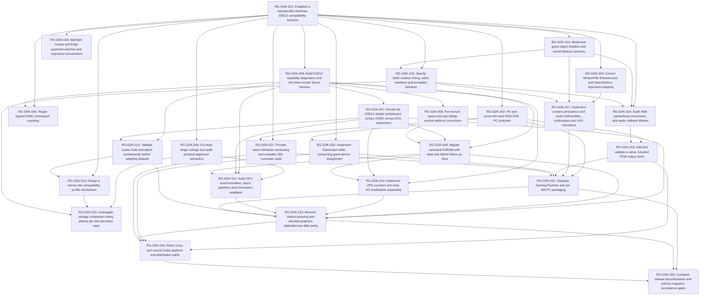

# Sequential GitHub roadmap

Snapshot: 2026-09-23. These are planning issues, not completed migrations. Dependencies are completion gates. The graph is validated by `python scripts/validate_roadmap.py`; live issue bodies are verified after publication.

## Actual issue index

| Planning ID | GitHub issue / objective | Depends on | Labels |
| --- | --- | --- | --- |
| [RG-GDK-001](roadmap/RG-GDK-001.md) | [Establish a reproducible Windows D3D12 compatibility baseline](https://github.com/furqanagwan/rexglue-sdk/issues/1) | None | testing, build, documentation, agent-ready |
| [RG-GDK-002](roadmap/RG-GDK-002.md) | [Pin and prove the April 2026 GDK PC toolchain](https://github.com/furqanagwan/rexglue-sdk/issues/2) | RG-GDK-001 | gdk, windows, build, research, blocked |
| [RG-GDK-003](roadmap/RG-GDK-003.md) | [Correct NtOpenFile ShareAccess and OpenOptions argument mapping](https://github.com/furqanagwan/rexglue-sdk/issues/3) | RG-GDK-001 | xboxkrnl, compatibility, testing, upstream-sync, blocked |
| [RG-GDK-004](roadmap/RG-GDK-004.md) | [Fix heap range ceilings and audit physical alignment semantics](https://github.com/furqanagwan/rexglue-sdk/issues/4) | RG-GDK-001 | compatibility, testing, upstream-sync, research, blocked |
| [RG-GDK-005](roadmap/RG-GDK-005.md) | [Repair signed DXBC memexport rounding](https://github.com/furqanagwan/rexglue-sdk/issues/5) | RG-GDK-001, RG-GDK-006 | gpu, d3d12, regression, upstream-sync, blocked |
| [RG-GDK-006](roadmap/RG-GDK-006.md) | [Build D3D12 capability diagnostics and the three-vendor fixture harness](https://github.com/furqanagwan/rexglue-sdk/issues/6) | RG-GDK-001 | gpu, directx, d3d12, amd, nvidia, intel, testing, blocked |
| [RG-GDK-007](roadmap/RG-GDK-007.md) | [Decide the D3D12 shader architecture using a DXBC versus DXIL experiment](https://github.com/furqanagwan/rexglue-sdk/issues/7) | RG-GDK-006 | architecture, gpu, d3d12, research, blocked |
| [RG-GDK-008](roadmap/RG-GDK-008.md) | [Port texture layout and sub-32bpp resolve address corrections](https://github.com/furqanagwan/rexglue-sdk/issues/8) | RG-GDK-006 | gpu, d3d12, compatibility, upstream-sync, blocked |
| [RG-GDK-009](roadmap/RG-GDK-009.md) | [Migrate canonical EDRAM with alias and MSAA follow-up fixes](https://github.com/furqanagwan/rexglue-sdk/issues/9) | RG-GDK-006, RG-GDK-007, RG-GDK-008 | gpu, d3d12, amd, regression, migration, blocked |
| [RG-GDK-010](roadmap/RG-GDK-010.md) | [Implement ZPD counters and track VIZ predication separately](https://github.com/furqanagwan/rexglue-sdk/issues/10) | RG-GDK-006, RG-GDK-007, RG-GDK-009 | gpu, d3d12, compatibility, research, upstream-sync, blocked |
| [RG-GDK-011](roadmap/RG-GDK-011.md) | [Audit GPU synchronization, async pipelines and memexport readback](https://github.com/furqanagwan/rexglue-sdk/issues/11) | RG-GDK-004, RG-GDK-006, RG-GDK-007, RG-GDK-009 | gpu, d3d12, regression, compatibility, blocked |
| [RG-GDK-012](roadmap/RG-GDK-012.md) | [Validate scalar math and depth workarounds before adopting defaults](https://github.com/furqanagwan/rexglue-sdk/issues/12) | RG-GDK-006, RG-GDK-007 | gpu, d3d12, game-specific, research, regression, blocked |
| [RG-GDK-013](roadmap/RG-GDK-013.md) | [Design a narrow title compatibility profile mechanism](https://github.com/furqanagwan/rexglue-sdk/issues/13) | RG-GDK-001, RG-GDK-012 | architecture, game-specific, compatibility, research, blocked |
| [RG-GDK-014](roadmap/RG-GDK-014.md) | [Modernize guest object headers and kernel lifetime contracts](https://github.com/furqanagwan/rexglue-sdk/issues/14) | RG-GDK-001 | xboxkrnl, compatibility, regression, research, blocked |
| [RG-GDK-015](roadmap/RG-GDK-015.md) | [Specify static-runtime timing, waits, teardown and exception behavior](https://github.com/furqanagwan/rexglue-sdk/issues/15) | RG-GDK-001, RG-GDK-014 | xboxkrnl, windows, regression, research, blocked |
| [RG-GDK-016](roadmap/RG-GDK-016.md) | [Investigate storage completion timing without per-title allocation caps](https://github.com/furqanagwan/rexglue-sdk/issues/16) | RG-GDK-004, RG-GDK-013, RG-GDK-015 | compatibility, game-specific, research, xboxkrnl, blocked |
| [RG-GDK-017](roadmap/RG-GDK-017.md) | [Implement content persistence and audit XAM profiles, notifications and XEX transitions](https://github.com/furqanagwan/rexglue-sdk/issues/17) | RG-GDK-003, RG-GDK-014, RG-GDK-015 | xam, compatibility, regression, upstream-sync, blocked |
| [RG-GDK-018](roadmap/RG-GDK-018.md) | [Audit XMA packet/loop correctness and audio callback lifetime](https://github.com/furqanagwan/rexglue-sdk/issues/18) | RG-GDK-001, RG-GDK-014, RG-GDK-015 | audio, compatibility, regression, upstream-sync, blocked |
| [RG-GDK-019](roadmap/RG-GDK-019.md) | [Add and validate a native XAudio2 PCM output driver](https://github.com/furqanagwan/rexglue-sdk/issues/19) | RG-GDK-002, RG-GDK-018 | audio, windows, gdk, migration, blocked |
| [RG-GDK-020](roadmap/RG-GDK-020.md) | [Implement GameInput while preserving guest device assignment](https://github.com/furqanagwan/rexglue-sdk/issues/20) | RG-GDK-001, RG-GDK-002 | input, windows, gdk, compatibility, blocked |
| [RG-GDK-021](roadmap/RG-GDK-021.md) | [Provide native Windows windowing and complete SDL consumer audit](https://github.com/furqanagwan/rexglue-sdk/issues/21) | RG-GDK-001, RG-GDK-002 | windows, migration, build, blocked |
| [RG-GDK-022](roadmap/RG-GDK-022.md) | [Integrate Gaming Runtime and per-title PC packaging](https://github.com/furqanagwan/rexglue-sdk/issues/22) | RG-GDK-002, RG-GDK-017, RG-GDK-019, RG-GDK-020, RG-GDK-021 | gdk, windows, build, migration, blocked |
| [RG-GDK-023](roadmap/RG-GDK-023.md) | [Remove Vulkan backend and obsolete graphics dependencies after parity](https://github.com/furqanagwan/rexglue-sdk/issues/23) | RG-GDK-007, RG-GDK-009, RG-GDK-010, RG-GDK-011, RG-GDK-012, RG-GDK-022 | cleanup, gpu, d3d12, migration, blocked |
| [RG-GDK-024](roadmap/RG-GDK-024.md) | [Retire Linux and macOS build, platform and distribution paths](https://github.com/furqanagwan/rexglue-sdk/issues/24) | RG-GDK-019, RG-GDK-020, RG-GDK-021, RG-GDK-023 | cleanup, windows, migration, build, blocked |
| [RG-GDK-025](roadmap/RG-GDK-025.md) | [Complete release documentation and enforce migration acceptance gates](https://github.com/furqanagwan/rexglue-sdk/issues/25) | RG-GDK-022, RG-GDK-023, RG-GDK-024 | documentation, testing, architecture, blocked |
| [RG-GDK-026](roadmap/RG-GDK-026.md) | [Maintain Canary and Edge upstream watches and regression provenance](https://github.com/furqanagwan/rexglue-sdk/issues/26) | RG-GDK-001 | upstream-sync, research, regression, blocked |

## Verified dependency graph

Arrows mean prerequisite → dependent. All planning references resolve to one issue; reverse “Blocks” lists are derived from the same graph.

## Agent-ready queue and first implementation

Only **RG-GDK-001** is initially `agent-ready`: baseline tooling has settled architecture, no dependencies, concrete files, reviewed regression evidence and measurable negative tests. Its actual title/hardware runs still require legally supplied material and available hardware. No other issue is ready until its dependency and research gates pass. Readiness is not a compatibility certification.

Recommended first implementation: RG-GDK-001. After baseline, RG-GDK-003 (NtOpenFile ABI) is the smallest source-confirmed runtime correction. RG-GDK-004 and RG-GDK-005 address confirmed memory/shader defects; larger migrations follow the graph.

## Label plan

Use existing `documentation` rather than a duplicate docs label. Create missing labels only in the implementation fork. `agent-ready` is a strict readiness signal, `blocked` is applied when an actual dependency/external gate prevents implementation, `research` for unsettled semantics, `regression` for regression prevention or verified regression bugs. An upstream regression label does not assert local reproduction. Vendor labels identify required validation, not support certification.

Evaluated labels: architecture, research, xenia, xenia-canary, xenia-edge, upstream-sync, game-specific, compatibility, regression, gpu, directx, d3d12, amd, nvidia, intel, xboxkrnl, xam, audio, input, gdk, windows, build, cleanup, migration, testing, documentation, agent-ready, blocked. Project-name labels are omitted where `upstream-sync` plus explicit source links suffice; labels actually applied are visible in the index.

## Upstream → ReXGlue mapping

[Upstream review](upstream-review.md) maps all current open items and selected recent closed items to an owning planning ID or an explicit exclusion. [Tracking ledger](upstream-tracking.md) supplies full commit/PR scope and adaptation evidence; [machine-readable snapshot](upstream-snapshot.json) allows mapping by exact upstream URL. Use this table above to resolve each planning ID to its actual GitHub issue. This avoids duplicating each upstream issue.

## Current regression tracking

[Regression index](regression-strategy.md#regression-tracking-index) maps reported upstream hazards to these issues. No new local compatibility regression was reproduced during the investigation; no fabricated local regression bug was filed. The regression issue template is ready for actual baseline comparisons.

## Publication and handoff

Complete issue bodies are preserved in `docs/roadmap/RG-GDK-*.md`; `index.json` stores labels, dependencies and actual issue numbers/URLs. Documentation and source references use the pinned investigation baseline. Agents need README, AGENTS and their assigned issue, not earlier chat context. Re-run live status/readiness checks when dependencies close.
